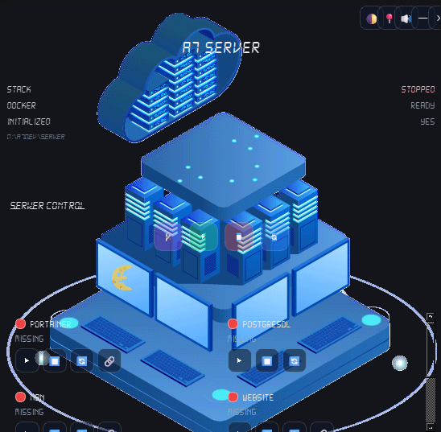

# A7 Server (Docker)



Docker-based home server stack. Services run in containers and are exposed on your local network and the internet.

## Services

| Service | Purpose | Default port |
|---------|---------|--------------|
| **Portainer** | Main dashboard — manage containers, images, volumes | 9443 |
| **n8n** | Workflow automation + AI agent | 5678 |
| **PostgreSQL** | n8n database (internal only) | — |
| **LM Studio** | Local LLM server (llmster, GPU) for OpenClaw | 1234 |
| **OpenClaw** | AI agent gateway (uses LM Studio) | 18789 |
| **Mail server** | Self-hosted mail (Mailcow or similar) | 25, 587, 993 |
| **Website hosting** | Static sites / web apps via Nginx | 80, 443 |

## Prerequisites

- [Docker Desktop](https://www.docker.com/products/docker-desktop/) (Windows)
- NVIDIA GPU + [NVIDIA Container Toolkit](https://docs.nvidia.com/datacenter/cloud-native/container-toolkit/install-guide.html) in Docker Desktop (for LM Studio)
- CMD or PowerShell with admin rights when binding low ports

## Quick start

```cmd
cd d:\A7Dev\Server
```

1. Edit `docker\.env` — set **`LM_STUDIO_MODELS_PATH`** to your models folder (e.g. `D:/LLM/models`)
2. Run:

```cmd
init.cmd
startup.cmd
```

- **init.cmd** — first-time install only (folders, `.env`, images, n8n deps, OpenClaw config)
- **startup.cmd** — start the server (`--no-build`, no installs)
- **stop.cmd** — stop all containers

Open **Portainer**: `https://localhost:9443`  
Open **OpenClaw**: `http://localhost:18789`  
LM Studio API: `http://localhost:1234`

## LM Studio (GPU container, host models)

Uses official [llmster](https://lmstudio.ai/docs/developer/core/headless) installed inside the container on first boot (picks the GPU bundle when NVIDIA is visible). OpenClaw connects per [LM Studio + OpenClaw](https://lmstudio.ai/docs/integrations/openclaw).

In `docker\.env`:

```env
# Your models on the host (required)
LM_STUDIO_MODELS_PATH=D:/LLM/models

# llmster binary + config (container cache, in repo)
LM_STUDIO_DATA_PATH=./lmstudio-data

LM_STUDIO_MODEL_ID=gemma-4-e2b-it
```

Mounts:

| Host | Container |
|------|-----------|
| `LM_STUDIO_MODELS_PATH` | `/root/.lmstudio/models` |
| `LM_STUDIO_DATA_PATH` | `/root/.lmstudio` (bin, config) |

Put GGUF / LM Studio model files in your host folder. First boot downloads llmster (~few min). Then load a model:

```cmd
docker exec -it a7_server_1-lmstudio lms ls
docker exec -it a7_server_1-lmstudio lms load gemma-4-e2b-it --gpu max
docker exec -it a7_server_1-lmstudio nvidia-smi
```

Requires `gpus: all` in compose and NVIDIA drivers on the host.

## Image versions

Microservice images are pinned in `docker\.env` (see `.env.example`). Docker only pulls or builds when a pinned image is missing locally. To upgrade, bump the version in `.env`, then run `init.cmd --force`.

| Variable | Default | Service |
|----------|---------|---------|
| `PORTAINER_VERSION` | `2.39.3` | Portainer CE |
| `POSTGRES_VERSION` | `16.8-alpine` | PostgreSQL |
| `NGINX_VERSION` | `1.27.5-alpine` | Website |
| `N8N_VERSION` | `2.26.6` | n8n |
| `NODE_VERSION` | `22-bookworm-slim` | n8n base image |
| `UBUNTU_VERSION` | `22.04` | LM Studio base image |
| `OPENCLAW_VERSION` | `2026.5.4` | OpenClaw |

## Project layout

```
Server/
├── readme.md
├── init.cmd
├── startup.cmd
├── stop.cmd
├── scripts/                      ← OpenClaw sync, health wait
└── docker/
    ├── docker-compose.yml
    ├── .env.example
    ├── lmstudio-image/             ← GPU llmster Docker build
    ├── lmstudio-data/              ← llmster install cache (gitignored)
    ├── portainer/
    ├── n8n/
    ├── postgres/
    ├── openclaw/
    ├── shared/
    ├── mail/
    └── www/
```

## Network: local LAN + internet

Published ports on your LAN:

- `http://<your-pc-ip>:5678` — n8n
- `http://<your-pc-ip>:18789` — OpenClaw
- `http://<your-pc-ip>:1234` — LM Studio API

```cmd
ipconfig
```

## n8n AI agent + browser (optional)

Stock custom n8n image. Community nodes and Puppeteer Chrome are installed once during `init.cmd`. After adding nodes in the UI, run `scripts\setup-n8n-deps.cmd`.

## Common commands

```cmd
cd d:\A7Dev\Server

init.cmd
startup.cmd
stop.cmd

docker compose -f docker\docker-compose.yml logs -f lmstudio
```

## OpenClaw + LM Studio

OpenClaw is configured to use the Docker LM Studio service (`http://lmstudio:1234/v1`) with the model from `LM_STUDIO_MODEL_ID` in `docker\.env` (default: `gemma-4-e2b-it`).

On first `startup.cmd`, OpenClaw runs non-interactive onboarding and sets memory search to `lmstudio`. To re-run:

```cmd
scripts\setup-openclaw-lmstudio.cmd --force
```

Ensure `LM_STUDIO_MODELS_PATH` points at your host models folder (e.g. `D:/AI Models`) and the model id matches `docker exec a7_server_1-lmstudio lms ls`.

**OpenClaw vs n8n:** n8n sends short prompts; OpenClaw sends a large agent system prompt (~13k+ tokens). Set `LM_STUDIO_CONTEXT_LENGTH=65536` in `docker\.env` (default). The lmstudio container unloads any restored session and reloads the model with that context on start.

## OpenClaw gateway token

`init.cmd` generates `OPENCLAW_GATEWAY_TOKEN` in `docker\.env`. `startup.cmd` opens the dashboard with that token pre-filled (via URL fragment, not logged server-side).

To reopen later without the token prompt: `scripts\open-openclaw-dashboard.cmd`

## Next steps

1. Set `LM_STUDIO_MODELS_PATH` and `LM_STUDIO_MODEL_ID` in `docker\.env`
2. Run `init.cmd` then `startup.cmd`
3. Load a model in LM Studio (see `lms load` above)
4. Open OpenClaw at `http://localhost:18789`
